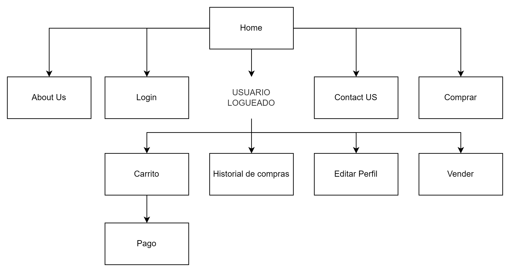

# ScholarMarket

Repositorio del proyecto integrador elaborado durante el bootcamp Generation Mexico, el proyecto consiste en una e-commers estudiantil.

### Público objetivo

Estudiantes y profesores de escuelas y/o universidades interesados en la compra y venta de artículos.

### **Misión, visión y valores**

#### Misión

Proporcionar a profesores y estudiantes de escuelas/universidades, la oportunidad de comprar o vender productos siempre y cuando cumplan con las normativas de las instituciones; buscamos realizar esto por medio de una
plataforma intuitiva y fácil de usar que permita a los vendedores publicar sus productos de manera sencilla y eficiente, siendo accesible desde cualquier dispositivo con acceso a internet.

#### Visión

La visión de nuestra plataforma es facilitar el proceso de venta para vendedores y clientes en el contexto escolar, ofreciendo un servicio accesible y de alta calidad. Buscamos ser un aliado para el crecimiento de los negocios
de nuestros vendedores y mejorar la visibilidad de sus productos. Además, nuestra plataforma es segura y confiable, con valores de transparencia y honestidad. Nuestra visión es liderar el mercado de la venta en línea para escuelas, ofreciendo una plataforma innovadora y eficaz que satisfaga las necesidades de todos los usuarios.

#### Valores

1. Integridad: La honestidad y la transparencia en todas las relaciones con los clientes, proveedores y otros socios de
   negocios.
2. Calidad: La dedicación a ofrecer productos y servicios de alta calidad que satisfagan las necesidades de los clientes.
3. Innovación: La disposición a adoptar nuevas tecnologías y formas de hacer negocios para mejorar la experiencia del
   cliente y la eficiencia operativa.
4. Flexibilidad: La capacidad de adaptarse a los cambios en el mercado y las necesidades de los clientes, y
   la disposición a ser ágil y responder rápidamente a las nuevas oportunidades y desafíos.

#### Propuesta de valor

La principal ventaja es que se proporciona una aplicación
exclusiva para el mercado escolar, para la compra y venta de productos. La
aplicación está diseñada para vendedores locales y es de acceso gratuito, lo
que permite interacción social y adicionalmente también se permite la
evaluación de los vendedores.

#### **Mapa de navegación**

#### **Desarrollo**

##### Tecnologías utilizadas

| Front End         | Back End    | Base de datos | Control de versiones |
| ----------------- | ----------- | ------------- | -------------------- |
| HTML5             | JAVA        | MYSQL         | Git                  |
| CSS3              | Spring Boot |               | GitHub               |
| Bootstrap 5       | FireBase    |               |                      |
| ECMAScript 6 (JS) | Postman     |               |                      |

#### **Lanzamiento**

El despliegue y publicación de la plataforma en la web se hará a través
de railway, el día 14/04/2023.
